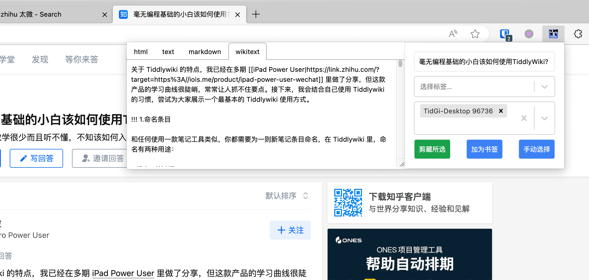
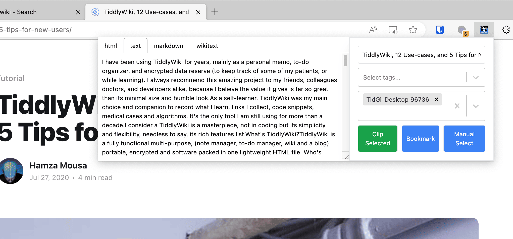

# TiddlyWiki Collector: A Browser Extension connect to NodeJS Version of TiddlyWiki or TidGi APP

[中文 Readme](./docs/Readme-zh.md)

## Features

- Clip webpage, save as markdown or wikitext to your wiki.
- Bookmark a webpage URI as a tiddler in your wiki.
  - And show it in a browser sidebar (WIP).
  - Search & View bookmarked tiddlers in browser (WIP).
- Search your wiki from address bar (WIP).

## Usage

1. Add your Nodejs TiddlyWiki's WebServer API URL to the "Options" of this extension.
2. Click on extension icon to open popup of this extension. You can see some buttons to save the page to your wiki.

## FAQ

### Can' connect to wiki

Use `localhost` instead of `192.168.xxx.xxx`, because Firefox will try to add `https` prefix if you are not using localhost, and there is no https on your wiki.

## Browser Support

|  |  |  |  |  |
| ---------------------------------------------------------------------------------------------------------------------------------------------------------------------------------------------- | ------------------------------------------------------------------------------------------------------------------------------------------------------------- | ---------------------------------------------------------------------------------------------------------------------------------------------------------------------------------------- | ------------------------------------------------------------------------------------------------------------------------------------------------------------------------------------------- | ------------------------------------------------------------------------------------------------------------------------------------------------------------------------------------------- |
| [Install](https://chrome.google.com/webstore/detail/tiddlywiki-collector/mgblpgmmbdbbndgfdjhjcfbkpoanafgo)                                                                                     | [Install](https://addons.mozilla.org/firefox/addon/tiddlywiki-collector/)                                                                                     | [Install](https://chrome.google.com/webstore/detail/tiddlywiki-collector/mgblpgmmbdbbndgfdjhjcfbkpoanafgo)                                                                               | [Install](https://chrome.google.com/webstore/detail/tiddlywiki-collector/mgblpgmmbdbbndgfdjhjcfbkpoanafgo)                                                                                  | [Install](https://chrome.google.com/webstore/detail/tiddlywiki-collector/mgblpgmmbdbbndgfdjhjcfbkpoanafgo)                                                                                  |

### Screenshots

The popup when you Click on extension icon:

With English localization:

## Contributing

## Privacy

This Extension is local-first, don't collect any user data.
