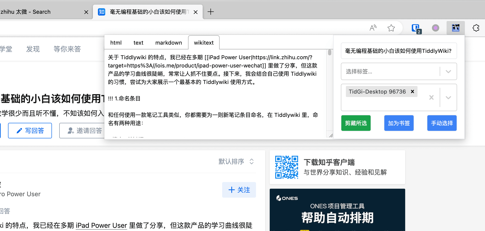
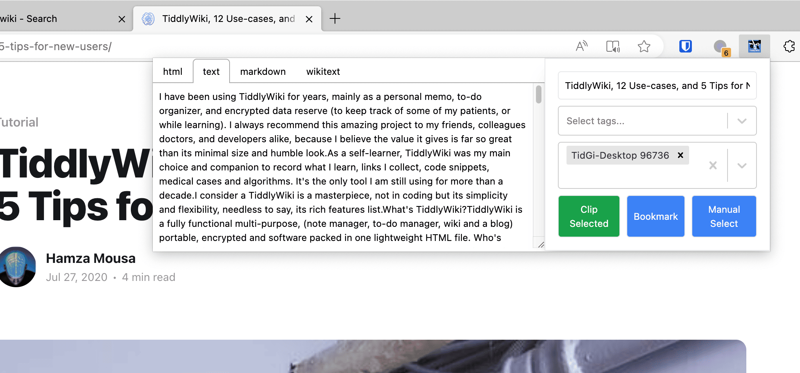

# 太微搜藏：连接 NodeJS 版本的太微或太记 APP 的浏览器扩展程序

[English Readme](../README.md)

## 功能介绍

- 剪切网页，以 markdown 或 wikitext 的形式保存到你的 wiki 中。
- 将网页 URI 保存为 wiki 中的书签条目。
- 在浏览器侧边栏中显示书签（WIP）。
- 在浏览器中搜索并查看已添加书签的 tiddlers（WIP）。
- 从地址栏搜索你的 wiki (WIP)。

## 使用方法

1. 将你的 Nodejs 版太微的 WebServer API 链接地址添加到此扩展的「选项」中。
2. 点击扩展图标，打开该扩展的弹出窗口。你可以看到一些将页面保存到维基的按钮。

## 浏览器支持

|  |  |  |  |  |
| ---------------------------------------------------------------------------------------------------------------------------------------------------------------------------------------------- | ------------------------------------------------------------------------------------------------------------------------------------------------------------- | ---------------------------------------------------------------------------------------------------------------------------------------------------------------------------------------- | ------------------------------------------------------------------------------------------------------------------------------------------------------------------------------------------- | ------------------------------------------------------------------------------------------------------------------------------------------------------------------------------------------- |
| [Install](https://chrome.google.com/webstore/detail/tiddlywiki-collector/mgblpgmmbdbbndgfdjhjcfbkpoanafgo)                                                                                     | [Install](https://addons.mozilla.org/firefox/addon/tiddlywiki-collector/)                                                                                     | [Install](https://chrome.google.com/webstore/detail/tiddlywiki-collector/mgblpgmmbdbbndgfdjhjcfbkpoanafgo)                                                                               | [Install](https://chrome.google.com/webstore/detail/tiddlywiki-collector/mgblpgmmbdbbndgfdjhjcfbkpoanafgo)                                                                                  | [Install](https://chrome.google.com/webstore/detail/tiddlywiki-collector/mgblpgmmbdbbndgfdjhjcfbkpoanafgo)                                                                                  |

### 截图

点击扩展图标时弹出的窗口：

多语言界面：

## 常见问题解答

### 无法连接到 wiki

使用 `localhost` 而不是 `192.168.xxx.xxx`，因为如果您不使用 localhost，Firefox 会尝试添加 `https` 前缀，而您的太记 wiki 上一般没有 https，只有 http。
